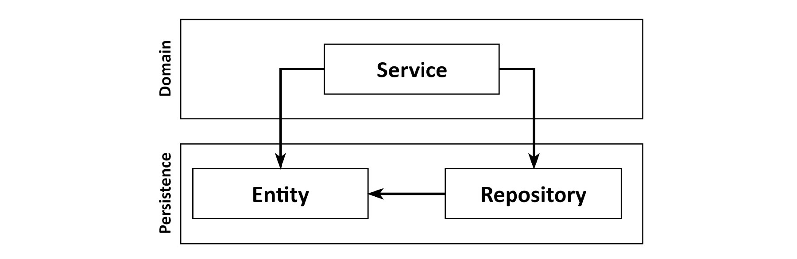
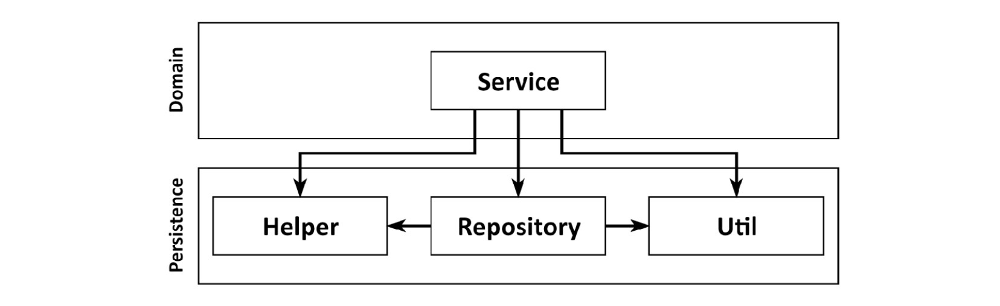
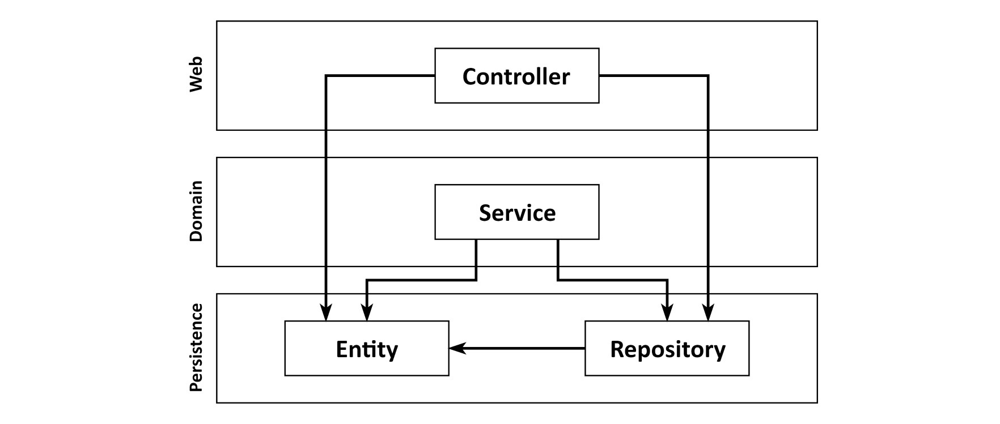
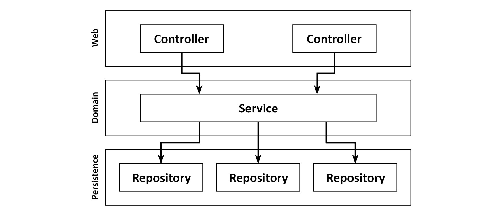

# Chapter 1 What's Wrong with Layers?
It has even been taught in books (Software Architecture Patterns by Mark Richards, O'Reilly, 2015):

Figure 1.1: A conventional web application architecture consists of a web layer, a domain layer, and a persistence layer
## It Promotes Database-Driven Design
If we combine an ORM framework with a layered architecture, we're easily tempted to mix business rules with persistence aspects:

Usually, we have ORM-managed entities as part of the persistence layer, as shown in the preceding figure. Since layers may access the layers below them, the Domain layer is allowed to access those entities. And if it's allowed to use them, they **will** be used.

**This creates a strong coupling between the Persistence layer and the Domain layer**. Our services use the persistence model as their business model and not only have to deal with the domain logic but also with eager versus lazy loading, database transactions, flushing caches, and similar housekeeping tasks.

The persistence code is virtually fused into the domain code, and thus **it's hard to change one without the other**. That's the opposite of being flexible and keeping options open, which should be the goal of our architecture.
## It's Prone to Shortcuts
I'm not saying that as developers, we take such shortcuts lightly. But if there is an option to do something, someone will do it, especially in combination with a looming deadline. And if something has been done before, the threshold for someone to do it again will lower drastically. This is a psychological effect called the "Broken Windows Theory" – more on this in Chapter 11, Taking Shortcuts Consciously:

Over years of development and maintenance of a software project, the persistence layer may very well end up like the one in the preceding figure.

## It Grows Hard to Test
A common evolution within a layered architecture is that layers are being skipped. We access the Persistence layer directly from the Web layer since we're only manipulating a single field of an Entity, and for that we need not bother the Domain layer, right?

Figure 1.4: Skipping the domain layer tends to scatter domain logic across the code base

Again, this feels OK the first couple of times, but it has two drawbacks if it happens often (and it will, once someone has done the first step).

As the web component grows over time, it may accumulate a lot of dependencies to different persistence components, adding to the test's complexity. At some point, it takes more time for us to understand and mock away the dependencies than to actually write test code.

## It Hides the Use Cases
As developers, we like to create new code that implements shiny new use cases. But we usually spend much more time changing existing code than we do creating new code. This is not only true for those dreaded legacy projects in which we're working on a decades-old code base but also for a hot new greenfield project after the initial use cases have been implemented.

Since we're so often searching for the right place to add or change functionality, our architecture should help us to quickly navigate the code base. How is a layered architecture holding up in this regard?

Figure 1.5: Broad services make it hard to find a certain use case within the code base

A broad service has many dependencies on the persistence layer, and many components in the web layer depend on it. This not only makes the service hard to test but also makes it hard for us to find the service that's responsible for the use case we want to work on.

How much easier would it be if we had highly specialized narrow domain services that each serve a single use case? Instead of searching for the user registration use case in the **UserService**, we would just open up the **RegisterUserService** and start working.

## It Makes Parallel Work Difficult

Probably you know this famous conclusion from "The Mythical Man-Month," even if you haven't read the book:

"Adding manpower to a late software project makes it later" – The Mythical Man-Month: Essays on Software Engineering by Frederick P. Brooks, Jr., Addison-Wesley, 1995.

This also holds true, to a degree, to software projects that are not (yet) late. You cannot expect a large group of 50 developers to be 5 times as fast as a smaller team of 10 developers in every context. If they're working on a very large application where and they can split up in sub-teams and work on separate parts of the software, it may work, but in most contexts, they would stand on each other's feet.

To meet this expectation, our architecture must support parallel work. This is not easy. And a layered architecture doesn't really help us here.

Imagine we're adding a new use case to our application. We have three developers available. One can add the needed features to the web layer, one to the domain layer, and the third to the persistence layer, right?

Well, it usually doesn't work that way in a layered architecture. Since everything builds on top of the persistence layer, the persistence layer must be developed first. Then comes the domain layer, and finally the web layer. So, only one developer can work on the feature at the same time.

Ah, but the developers can define interfaces first, you say, and then each developer can work against these interfaces without having to wait for the actual implementation. Sure, this is possible, but only if we're not doing database-driven design, as discussed earlier, where our persistence logic is so mixed up with our domain logic that we just cannot work on each aspect separately.

If we have broad services in our codebase, it may even be hard to work on different features in parallel. Working on different use cases will cause the same service to be edited in parallel, which leads to merge conflicts and, potentially, regressions.